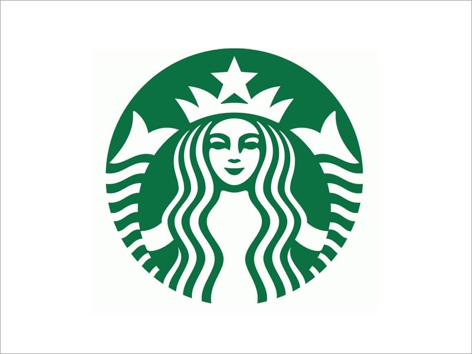
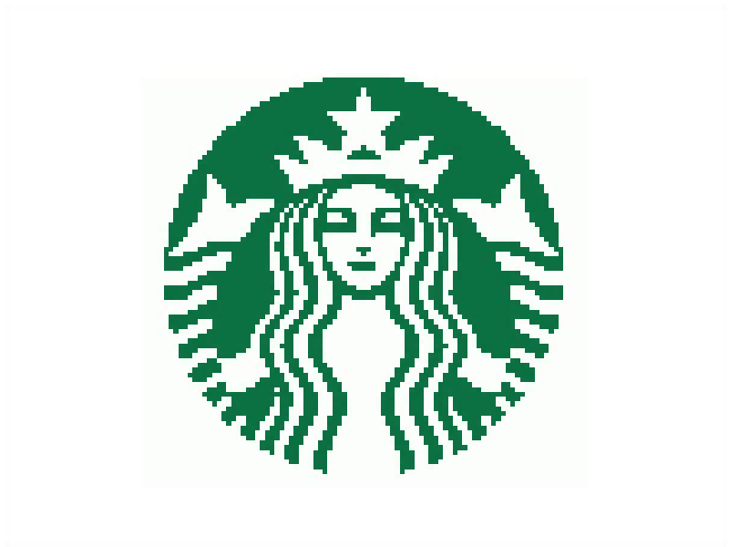

# Pixel 32 Image to Pixelart Tool

   
   📍<a href="https://pixelart-tools.vercel.app/" target="_blank">pixel32 Online Sample (host by vercel)</a>
   

源代码出处：  

 * pixelit - convert an image to Pixel Art, with/out grayscale and based on a color palette.
 * @author José Moreira @ <https://github.com/giventofly/pixelit>

#### 2024-09-08 

* 使用cursor优化了算法，一键生成像素画，可以通过滑块调整BLOCKSIZE查看效果
* 用户无需选择调色板，傻瓜式操作，所见即所得
* 上传图片，马上获得像素画
* 适合颜色数量较少的图片，转换效果较好，不推荐转换照片或渐变色丰富的数码插画。